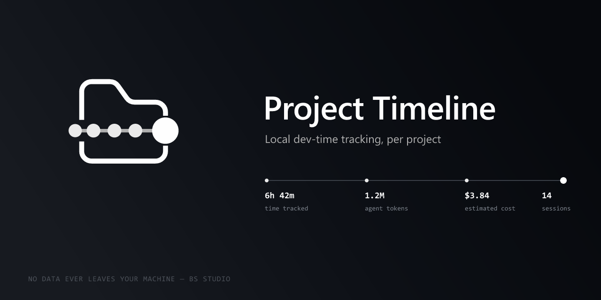

# Project Timeline



Local measurement of development effort **per project**: real time, time spent
with an active AI agent (Claude Code / Codex CLI), **tokens consumed and estimated cost**,
test runs, tasks, debug sessions, commits (enriched), diagnostics.

**No data ever leaves the machine.** No account, no backend, no telemetry.

## First time opening a project — history reconstruction

If the project has no measured data yet, the extension **reconstructs** a history on
first startup:

- **agents**: reads **all** past Claude Code / Codex CLI sessions → turns,
  tokens, estimated cost, per-model breakdown. `eventId`s are deterministic, so when
  live tracking resumes there is **no double counting**.
- **git**: full `git log` (via the `vscode.git` API) → enriched commits.
- **work time**: **estimated** per day from the spread of signals (commits + agent
  turns) + a 45-minute margin, capped at 12h/day. These sessions are **flagged `estimated`**
  and the dashboard shows the percentage of reconstructed time — never confused
  with measured time.

What is not reconstructed: fine-grained editing, diagnostics, tasks/debug, focus.

## Dashboard

- **Activity grid**, GitHub-style: one cell per day, intensity = time tracked.
- **Working hours**: day-of-week × hour heatmap (local time).
- **Time per day** (interaction / agent-only / idle) and **tokens per day** (Claude / Codex),
  30 days.
- **Project composition**: proportional bar of languages worked on (lines).
- **AI agents**: per agent → sessions, turns, cache hit ratio, cost, **per-model
  breakdown** (turns, in/out/cache, cost).
- **Most-worked files** over 7 days.

---

## What the extension knows — and doesn't

| It knows | It doesn't know |
|---|---|
| When VS Code is in the foreground / you're interacting | Whether you're thinking with the screen off, or working outside VS Code |
| That an agent (Claude Code / Codex CLI) has an active session for this project | Whether you're **waiting** on that agent or **reviewing its diff** — hence "active agent time", never "waiting" |
| Tokens and **estimated** cost per agent, from their local session files | The exact cost (prices are maintained by hand, versioned) |
| Test results run **in the integrated terminal** (shell integration) | Tests run outside the integrated terminal, or via Test Explorer (no public API) — **experimental feature** |
| Files created / deleted observed on disk (catches agents) | Every operation: subject to `files.watcherExclude`, may miss bursts |
| Errors / warnings via the Diagnostics API | Compilation ground truth (depends on installed language extensions) |

### Time dimensions overlap

`duration` is **not** the sum of the others. These are overlapping time sets:

| Dimension | Meaning |
|---|---|
| `duration` | session open (at least one signal within the tolerance window) |
| `focus` | ⊆ duration — VS Code window in the foreground |
| `editor interaction` | ⊆ duration — recent typing / selection / save |
| `agent active` | ⊆ duration — a project agent was writing to its session |
| `agent alone` | agent active **without** you typing (review or waiting, indistinguishable) |
| `focus alone / idle` | window in foreground, no typing or agent — thinking **tolerated**, capped |

### Session rule

A session stays open as long as one of these is true:
- recent editor interaction (< `idleTimeoutMinutes`, default 10);
- **or** a project agent wrote < `agentGraceMinutes` ago (default 3);
- **or** the window is in the foreground **and** < `idleTimeout` since the last keystroke
  (focus **alone** doesn't extend the session indefinitely — otherwise a VS Code window
  left open overnight would count the whole night).

An agent "grinding" for 25 minutes without you touching anything → the session **continues**
(its session file is rewritten on every turn). Once the agent goes quiet and the
window is in the background → the session closes after the tolerance window.

---

## Security

- **Project Timeline runs no commands and spawns no processes.** Commits
  go through the built-in Git extension's API (`vscode.git`) — it, not us,
  invokes `git`: seeing `git.exe` child processes of VS Code is normal.
- Writes **only** to the extension's storage folder
  (`context.globalStorageUri`): `events.jsonl`, `heartbeat.json`, `offsets.json`,
  `git-cursor.json`. Nothing in `.git`, `~/.claude`, `~/.codex`, or the tracked repo.
- No network requests. Dashboard charts drawn as inline SVG, strict CSP.

---

## Data model

One JSONL line per event, **append-only**, never modified. All metrics
are recomputed by aggregation. Each event carries an `eventId`:

- **deterministic** for anything re-read from a persistent source
  (`<agent>:<uuid>:<byteOffset>`, `commit:<hash>`) → a re-parse after a crash **doesn't
  double-count** (deduplicated at aggregation time);
- sequence-based for anything emitted once, live.

`offsets.json` is just a cache: lost or corrupted, it starts over from zero with no consequence.

**Crash recovery**: conservative. The state of the last `heartbeat` is recorded
(≤ 30s of possible loss) without reconstructing the following period — work minutes
are never invented.

---

## Estimated cost

Pricing tables in `pricing/claude.json` and `pricing/openai.json`, each with a
`version` / `date` / `source`. Every recorded cost carries its `pricingVersion`.
**This is an estimate** — update the prices by hand when they change.

Formula: `in·p_in + out·p_out + cacheCreate·p_in·1.25 + cacheRead·p_in·0.1` (per million).

---

## Commands

| Command | Effect |
|---|---|
| `Project Timeline: Open dashboard` | Webview: summary, time/day, tokens/day, heatmap, top files, agents |
| `Project Timeline: Show summary (Markdown)` | Markdown report in a tab |
| `Project Timeline: Export as JSON` / `as CSV` | Export aggregates |
| `Project Timeline: Open data folder` | Reveals `globalStorageUri` |
| `Project Timeline: Recompute rollups` | Refreshes the dashboard |

## Development

```bash
npm install
npm run build      # esbuild bundle -> dist/extension.js
npm test           # core unit tests (node --test), vscode-free
```

`F5` (the "Run Extension" config) opens an Extension Development Host on the current folder.

### Install without going through F5 (.vsix)

```bash
npm run package     # generates project-timeline-<version>.vsix
```

Then, in VS Code: Command Palette → **Extensions: Install from VSIX...** → select
the generated file. The extension then activates automatically on every VS Code
startup (`onStartupFinished`), without the Extension Development Host. To update: rebuild the `.vsix`,
reinstall (VS Code replaces the existing version).

### Known limitations to revisit

- The Codex session format keeps evolving: if `⚠️ N unread lines` appears in the
  dashboard (`unparsedLines`), the `parse-codex` parser needs adjusting.
- Codex launched with `--cd` from a subfolder: reattachment by `cwd` covers
  most cases.
- Test counting = integrated terminal shell integration only (v1). Vitest/Jest
  reporter adapters planned later.

---

<details>
<summary><strong>🇫🇷 Lire en français</strong></summary>

# Project Timeline


Mesure locale de l'effort de développement **par projet** : temps réel, temps passé
avec un agent IA actif (Claude Code / Codex CLI), **tokens consommés et coût estimé**,
exécutions de tests, tasks, sessions de debug, commits (enrichis), diagnostics.

**Aucune donnée ne quitte la machine.** Pas de compte, pas de backend, pas de télémétrie.

## Première ouverture d'un projet — reconstruction de l'historique

Si le projet n'a encore aucune donnée mesurée, l'extension **reconstruit** un historique au
premier démarrage :

- **agents** : lecture de **toutes** les sessions Claude Code / Codex CLI passées → tours,
  tokens, coût estimé, ventilation par modèle. Les `eventId` sont déterministes, donc quand
  le suivi live reprend il n'y a **aucun double comptage**.
- **git** : `git log` complet (via l'API `vscode.git`) → commits enrichis.
- **temps de travail** : **estimé** par jour depuis l'amplitude des signaux (commits + tours
  d'agent) + 45 min de marge, borné à 12 h/jour. Ces sessions sont **marquées `estimated`**
  et le tableau de bord affiche le pourcentage de temps reconstruit — jamais confondu avec
  du mesuré.

Ce qui n'est pas reconstruit : édition fine, diagnostics, tasks/debug, focus.

## Tableau de bord

- **Grille d'activité** façon GitHub : une case par jour, intensité = temps suivi.
- **Plages horaires de travail** : heatmap jour-de-semaine × heure (en heure locale).
- **Temps par jour** (interaction / agent seul / idle) et **tokens par jour** (Claude / Codex),
  30 jours.
- **Composition du projet** : barre proportionnelle des langages travaillés (lignes).
- **Agents IA** : par agent → sessions, tours, cache hit ratio, coût, **ventilation par
  modèle** (tours, in/out/cache, coût).
- **Fichiers les plus travaillés** sur 7 jours.

---

## Ce que l'extension fait — et ne fait pas

| Elle sait | Elle ne sait pas |
|---|---|
| Temps où VS Code est au premier plan / tu interagis | Si tu réfléchis écran éteint, ou travailles hors VS Code |
| Qu'un agent (Claude Code / Codex CLI) a une session active pour ce projet | Si tu **attends** cet agent ou si tu **relis son diff** — d'où « temps agent actif », jamais « attente » |
| Tokens et coût **estimé** par agent, depuis leurs fichiers de session locaux | Le coût exact (les prix sont maintenus à la main, versionnés) |
| Résultats de tests lancés **dans le terminal intégré** (shell integration) | Les tests lancés hors terminal intégré, ou via le Test Explorer (pas d'API publique) — **fonction expérimentale** |
| Fichiers créés / supprimés observés sur le disque (capte les agents) | Toutes les opérations : soumis à `files.watcherExclude`, peut manquer des rafales |
| Erreurs / avertissements via l'API Diagnostics | Une vérité de compilation (dépend des extensions de langage installées) |

### Les dimensions de temps se chevauchent

`durée` **n'est pas** la somme des autres. Ce sont des ensembles temporels superposés :

| Dimension | Sens |
|---|---|
| `durée` | session ouverte (au moins un signal dans la fenêtre de tolérance) |
| `focus` | ⊆ durée — fenêtre VS Code au premier plan |
| `interaction éditeur` | ⊆ durée — frappe / sélection / save récente |
| `agent actif` | ⊆ durée — un agent du projet écrivait dans sa session |
| `agent seul` | agent actif **sans** que tu tapes (relecture ou attente, non distinguables) |
| `focus seul / idle` | fenêtre au premier plan, ni frappe ni agent — réflexion **tolérée**, plafonnée |

### Règle de session

Une session reste ouverte tant que l'un est vrai :
- interaction éditeur récente (< `idleTimeoutMinutes`, défaut 10) ;
- **ou** un agent du projet a écrit il y a < `agentGraceMinutes` (défaut 3) ;
- **ou** la fenêtre est au premier plan **et** < `idleTimeout` depuis la dernière frappe
  (le focus **seul** ne prolonge pas indéfiniment — sinon un VS Code laissé ouvert
  toute la nuit compterait la nuit).

Un agent qui « mouline » 25 minutes sans que tu touches à rien → la session **continue**
(son fichier de session est réécrit à chaque tour). Une fois l'agent silencieux et la
fenêtre en arrière-plan → clôture au bout de la fenêtre de tolérance.

---

## Sécurité

- **Project Timeline n'exécute aucune commande et ne lance aucun processus.** Les commits
  passent par l'API de l'extension Git intégrée (`vscode.git`) — c'est elle, pas nous,
  qui invoque `git` : voir des `git.exe` enfants de VS Code est normal.
- Écriture **uniquement** dans le dossier de stockage de l'extension
  (`context.globalStorageUri`) : `events.jsonl`, `heartbeat.json`, `offsets.json`,
  `git-cursor.json`. Rien dans `.git`, `~/.claude`, `~/.codex`, ni le repo suivi.
- Aucune requête réseau. Graphiques du tableau de bord dessinés en SVG inline, CSP stricte.

---

## Modèle de données

Une ligne JSONL par événement, **append-only**, jamais modifiée. Tous les indicateurs
sont recalculés par agrégation. Chaque événement porte un `eventId` :

- **déterministe** pour ce qui est relu d'une source persistante
  (`<agent>:<uuid>:<byteOffset>`, `commit:<hash>`) → un re-parse après crash **ne
  double-compte pas** (déduplication à l'agrégation) ;
- de séquence pour ce qui est émis une seule fois en live.

`offsets.json` n'est qu'un cache : perdu ou corrompu, on repart de zéro sans conséquence.

**Recovery après crash** : conservateur. On enregistre l'état du dernier `heartbeat`
(≤ 30 s de perte possible) sans reconstruire la période suivante — on n'invente jamais
de minutes de travail.

---

## Coût estimé

Tables de prix dans `pricing/claude.json` et `pricing/openai.json`, chacune avec
`version` / `date` / `source`. Chaque coût enregistré porte son `pricingVersion`.
**C'est une estimation** — mets les prix à jour à la main quand ils changent.

Formule : `in·p_in + out·p_out + cacheCreate·p_in·1.25 + cacheRead·p_in·0.1` (par million).

---

## Commandes

| Commande | Effet |
|---|---|
| `Project Timeline: Ouvrir le tableau de bord` | Webview : résumé, temps/jour, tokens/jour, heatmap, top fichiers, agents |
| `Project Timeline: Afficher le résumé (Markdown)` | Rapport Markdown dans un onglet |
| `Project Timeline: Exporter en JSON` / `en CSV` | Export des agrégats |
| `Project Timeline: Ouvrir le dossier de données` | Révèle `globalStorageUri` |
| `Project Timeline: Recalculer les agrégats` | Rafraîchit le tableau de bord |

## Développement

```bash
npm install
npm run build      # bundle esbuild -> dist/extension.js
npm test           # tests unitaires du cœur (node --test), vscode-free
```

`F5` (config « Lancer l'extension ») ouvre un Extension Development Host sur le dossier courant.

### Installer sans repasser par F5 (.vsix)

```bash
npm run package     # génère project-timeline-<version>.vsix
```

Puis, dans VS Code : palette de commandes → **Extensions: Install from VSIX...** → sélectionner
le fichier généré. L'extension s'active alors automatiquement à chaque démarrage de VS Code
(`onStartupFinished`), sans Extension Development Host. Pour mettre à jour : rebuild le `.vsix`,
réinstaller (VS Code remplace la version existante).

### Limites connues à revérifier

- Le format des sessions Codex évolue : si `⚠️ N lignes non lues` apparaît dans le
  tableau de bord (`unparsedLines`), le parseur `parse-codex` est à ajuster.
- Codex lancé avec `--cd` depuis un sous-dossier : le rattachement par `cwd` couvre
  la plupart des cas.
- Comptage des tests = shell integration uniquement (v1). Adaptateurs reporter
  Vitest/Jest prévus plus tard.

</details>
